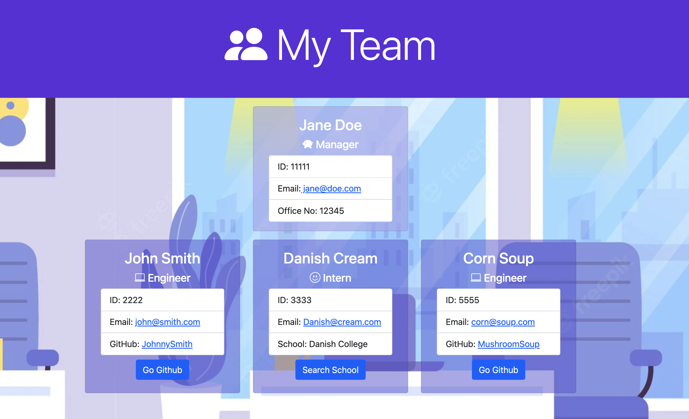

# Team Generator


## Description
This is an application that will run in your command line and asks a series of questions regarding your team profile.

It will start with the Manager details and then prompts to choose either an Engineer or Intern role. Once filled out, this will create a unique profile card for each of the employees. Validation is also included in the prompts to ensure correct information is filled out. 

These employees and the manager will be generated onto a HTML file that has CSS already styled for use. The HTML is also responsive for mobile viewing. 

When clicking on the email, the users default email program will open and populate the To field of the email with the address. If you click on the 'go github' button, you are taken to the github website. If you click on the 'Search school'button you are also able to search on google for the interns school. Dynamic icons are also included for each role. 

Video Walkthrough is [here]("https://www.loom.com/share/923c8f1337fd4fc5bb20341150c84f0c")




## Table of Contents

* [Installation](#installation)
* [Usage](#usage)
* [Licenses](#licenses)
* [Contributing](#contributing)
* [Tests](#tests)
* [Questions](#questions)

## Installation 
Please run the following command line to install the neccesary packages
```
npm i
```


## Usage
How to use this application

Once modules are installed, please run 'npm start' to start the program. Inquirer package will load and you will be welcomed with a Manager welcome message. 

Please answer the questions related to the Manager details and proceed to answer the questions regarding the other employee roles. Once all questions are answered and no more employees need to be added, a message will appear in the console notifying that the team had been generated and the index.html file is ready. 

Head over to the /dist/index.html file to view the final look of the generated team.
## Licenses
This project is under the MIT License.

## Contributing
Contributions are what make the open source community such an amazing place to learn, inspire, and create. 

Feel free to contribute by filing any issues or see if you can incorporate any cooler features
## Tests 
To run tests, use the following command:
```
npm run test
```

## Questions

If you have any questions regarding this repository, you can contact me directly at jh.yield@gmail.com or find more of my work at [Key16](https://github.com/Key16)